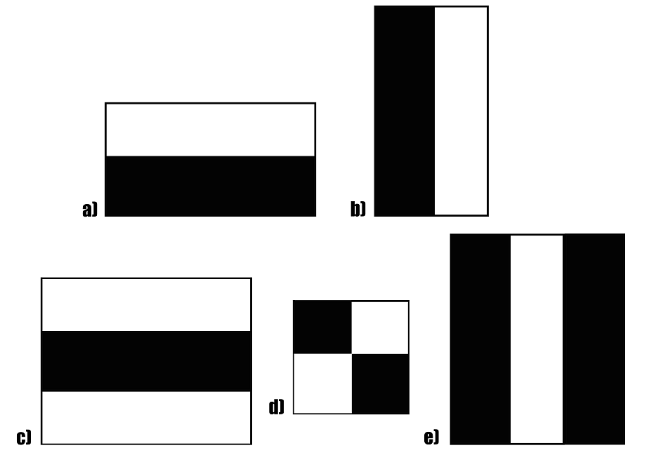
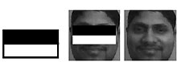

# Sebelum Memulai

Materi yang diberikan akan mencakup deteksi wajah sederhana menggunakan Haar Cascade Classifier menggunakan fungsi-fungsi yang sebelumnya telah dipelajari, namun akan dijabarkan lebih detail mengenai konsep-konsepnya. Silahkan untuk membaca-baca terlebih dahulu dan pastikan environment sudah memiliki modul yang dibutuhkan.

## Haar Cascade Classifier

Haar Cascade Classifier atau dikenal juga dengan Viola-Jones (Paul Viola & Michael Jones) object detection framework, adalah framework deteksi objek yang pertama kali dikemukakan pada tahun 2001 untuk menjawab permasalahan deteksi wajah yang muncul saat itu. [Paper](https://www.cs.cmu.edu/~efros/courses/LBMV07/Papers/viola-cvpr-01.pdf)

### Cara bekerja



Deteksi Haar menggunakan konsep yang disebut dengan deteksi fitur, gambar di atas menunjukkan contoh beberapa deteksi fitur yang digunakan untuk mendeteksi wajah manusia. Perhatikan contoh kedua gambar di bawah:


Contoh di atas menggunakan bentuk deteksi fitur (e) untuk mendeteksi daerah yang serupa dengan batang hidung manusia.



Contoh di atas menggunakan bentuk deteksi (a) yang diputar, untuk mendeteksi area mata dan pipi bagian atas.


Sebuah 'sliding window' digunakan dalam mendeteksi wajah berdasarkan deteksi fitur, setiap kali 'sliding window' bergerak akan dinyatakan apabila terdapat fitur wajah terdapat pada boks tersebut.

### Ups and downs

Deteksi Haar memiliki kelebihan dan kekurangannya, berikut adalah kelebihan yang dapat ditemukan di dalamnya:

- Cepat dalam mendeteksi objek
- Dapat diaplikasikan untuk deteksi **realtime**
- Implementasi mudah, tidak memakan banyak resource

Berikut adalah kekurangannya:

- Tidak terlalu akurat dibandingkan deteksi modern lain
- Memprediksi banyak **false positive**

    [](https://towardsdatascience.com/understanding-confusion-matrix-a9ad42dcfd62)

## Environment

Berikut adalah beberapa modul yang perlu di install untuk dapat mengikuti pelatihan ini tanpa adanya error:

- Python 3.10+ 
- Python CV2
- Numpy
- Matplotlib

Semuanya akan dijalankan pada local Jupyter Notebook (di dalam VSC), apabila dijalankan di Google Colaboratory maka
tidak dapat menjalankan deteksi secara **realtime**.

Repository ini memiliki file **requirements.txt**, apabila ingin install seluruh package secara automatis, silahkan lakukan:

1. Download file **requirements.txt**
2. Copy dan paste ke dalam folder proyek
3. Jalankan perintah berikut:

    ```bash
    pip install -r requirements.txt
    ```
    
4. Pastikan package telah terinstall

### Good Luck! 🍀
