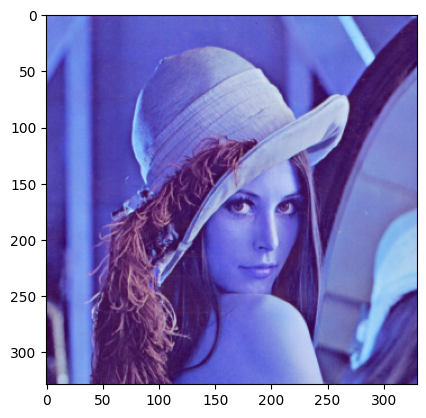
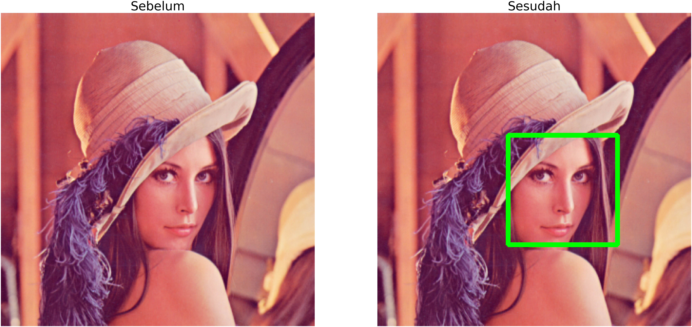

# Menampilkan Gambar dengan Matplotlib

Matplotlib adalah salah satu package Python yang dapat membantu kita dalam membuat berbagai hal yang berhubungan dengan plotting grafik. Selain plotting grafik, Matplotlib juga dapat kita gunakan untuk menampilkan gambar pada output Jupyter Notebook. Pastikan Matplotlib sudah terpasang di environment:

```python
pip install matplotlib
```

Gunakan kode di bawah untuk menambahkan Matplotlib ke dalam projek, kali ini hanya akan menggunakan `Matplotlib.pyplot`

```python
import matplotlib.pytplot as plt
```

## Basic Matplotlib syntax

Serupa dengan OpenCV, Matplotlib menampilkan gambar yang sebenarnya adalah NumPy array, maka dari itu konversi dari gambar asli ke dalam NumPy array perlu dilakukan sebelum memunculkannya ke Jupyter Notebook. Dalam konteks ini kita akan lanjut menggunakan OpenCV dalam konversi gambar ke NumPy array.

Perhatikan contoh berikut:

```python
import cv2
import numpy as np
import matplotlib.pyplot as plt # Hanya memerlukan .pyplot

lena_path = 'path/to/lena.png' # Tentukan path ke sebuah gambar

lena = cv2.imread(lena_path) # Fungsi imread akan membaca gambar dari lena_path sebagai NumPy array

imgplot = plt.imshow(lena) # Fungsi imshow dari matplotlib.pyplot

plt.show() # Fungsi eksekusi matplotlib, perhatikan output tidak membuat window baru melainkan berada di Jupyter Notebook 
```

Output:



Perlu diketahui bahwa membaca gambar menggunakan OpenCV dan mengeluarkannya menggunakan metode selain dari OpenCV (seperti Matplotlib), akan membalikkan format warna yang dibaca.

>
**Format OpenCV adalah Blue, Green, Red (BGR)**

**Format Matplotlib adalah Red, Green, Blue (RGB)**
>

Hal ini sangat mudah ditangani, kita hanya perlu menggunakan fungsi konversi warna yang telah disediakan oleh OpenCV, `cv2.cvtColor()`.

```python
lena_rgb = cv2.cvtColor(lena, cv2.COLOR_BGR2RGB) # Mengubah warna dari BGR ke RGB

imgplt = plt.imshow(lena_rgb)
plt.axis('off') # Mematikan skala yang ada di sisi gambar
plt.show()
```

Output:


## Plot Lebih dari Satu Gambar

Salah satu keuntungan menggunakan Matplotlib adalah, kita dapat mengeluarkan beberapa gambar sekaligus. Hal ini dapat mempermudah dalam membandingkan gambar yang sedang kita proses. Sebagai contoh, kode di bawah akan mengeluarkan gambar Lena sebelum dan sesudah melalui deteksi wajah.

```python
#... proses deteksi wajah
# lena_rgb1 => Foto asli sebelum deteksi
# lena_rgb2 => Foto yang telah ditimpa boks deteksi

fig = plt.figure(figsize = (10,5)) # Menentukan ukuran figura satu gambar

fig.add_subplot(1, 2, 1) # Membuat subplot 1 baris 2 kolom, akan mengisi posisi pertama (1)
plt.imshow(lena_rgb1)
plt.axis('off')
plt.title('Sebelum', fontsize = 100) # Membuat judul di atas plot

fig.add_subplot(1, 2, 2)# Membuat subplot 1 baris 2 kolom, akan mengisi posisi kedua (2)
plt.imshow(lena_rgb2)
plt.axis('off')
plt.title('Sesudah', fontsize = 100) # Membuat judul di atas plot

plt.show()

```

Output:



Silakan gunakan metode menampilkan gambar yang menjadi preferensi, namun perlu diperhatikan aspek-aspek keunggulan dan kekurangannya.

### Good Luck! 🍀
