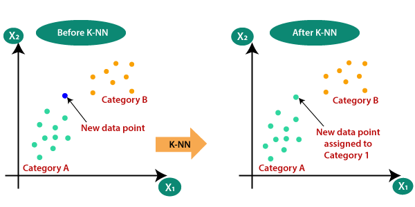
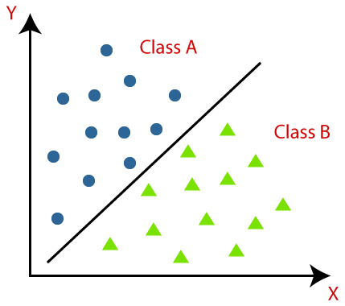
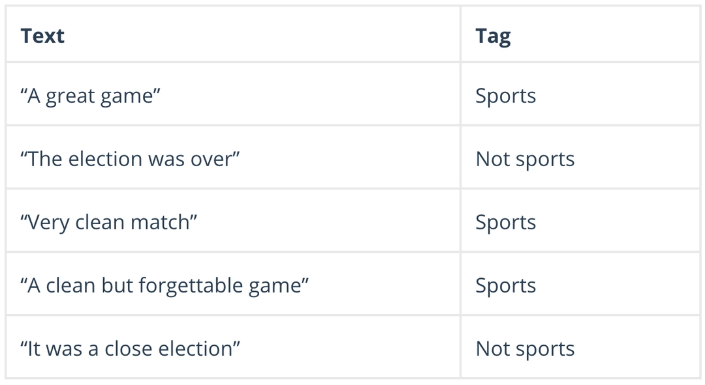
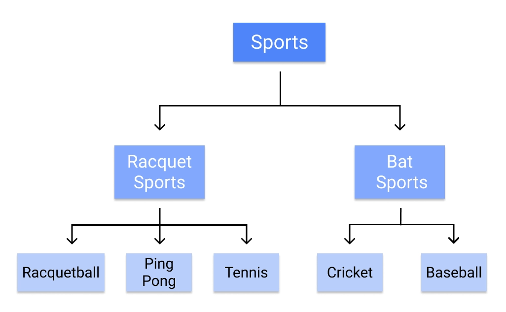
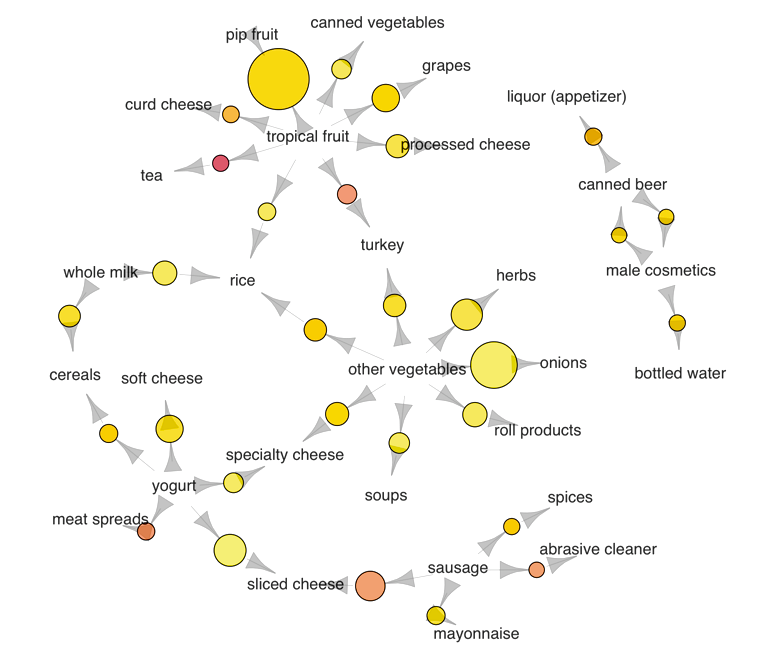
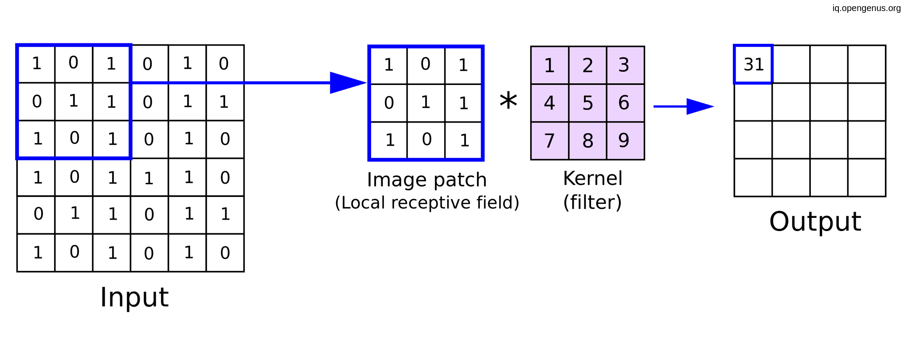

# sg-simple-image-processing
IMV's study group 

Pada modul ini kita akan belajar tentang pemrosesan gambar yang mudah dan simple.
Pemrosesan gambar yang paling mudah adalah menggunakan resource yang sudah tersedia.

Namun, sebelumnya kita perlu mempelajari ALGORITMA KLASIK dari image processing terlebih dahulu

# Pengelompokan (clustering)

    Clustering merupakan algoritma pengelompokan data. Kita ketahuibahwa data dapat dikelompokan sesuai dengan kriteria yang kita berikan.

    Hal ini penting sebagai dasar karena dalam pengolahan data citra, komputer membedakan fitur dari sebuah gambar dengan angka. 
    
    

    Clustering sendiri dapat dilakukan dengan beberapa metode yang dapat dipelajari. Pada python library yang digunakan adalah library scikit-learn. Library tsb dapat diinstall dengan menggunakan perintah pip ataupun pip3

# Regresi
    Regresi merupakan algoritma yang termasuk dalam supervised learning. Regresi sendiri merupakan metode statistik yang dipakai untuk memperkirakan hubungan antara sebuah variabel independen atau lebih. Regresi dapat digunakan untuk menilai kekuatan hubungan antara variabel dengan prediksi nilai masa depan. Oleh karena itu regresi menjadi dasar dari machine learning.

    

    Regresi memiliki beberapa metode dan variasi rumus.
        - Linear Regression 
        - Ridge Regression 
        - Neural Network Regression  
        - Lasso Regression  
        - Decision Tree Regression  
        - Gausian Regression 
        - Polynomial Regression 

# Klasifikasi
    Merupakan algoritma yang digunaka untuk mengkategorikan data kedalam beberapa kelas atau kategori tertentu. Klasifikasi juga dapat disebut "pattern recognition" dan dapat diaplikasikan kedalam bidang bidang tertentu (NLP, Number sequence, dll)
    
    
    

    Algoritma klasifikasi yang terkenal : 
    - Logistic Regression
    - Naive Bayes
    - K-Nearest Neighbors
    - Decision Tree
    - Support Vector Machines

    
    
    

# Asosiasi
    Algoritma asosiasi merupakan teknik dalam menemukan pola dan relasi (struktuk,dsb) dalam suatu data. Digunakan dalam data mining.

    Algoritma yang biasa digunakan : 
    - Apriori
    - Eclat
    - F-P Growth Algorithm

    
    lihat dari pola diatas kalau dalam variasi barang terdapat beberapa relasi dengan barang lainnya. Bisa dalam berbentuk kesamaan jenis packaging, jenis produk, maupun kegunaan produk.

# Konvolusi
    Algoritma konvolusi merupakan operasi yang umumnya dilakukan pada sebuah image untuk mengekstrak fitur (karakteristik) dari gambar tersebut dengan mengaplikasikan tensor yang lebih kecil (kernel) seperti menggeser jendela diatas gambar. 

    
    