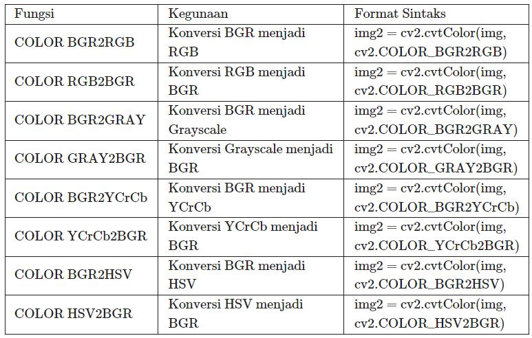
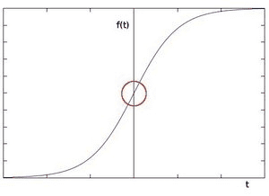
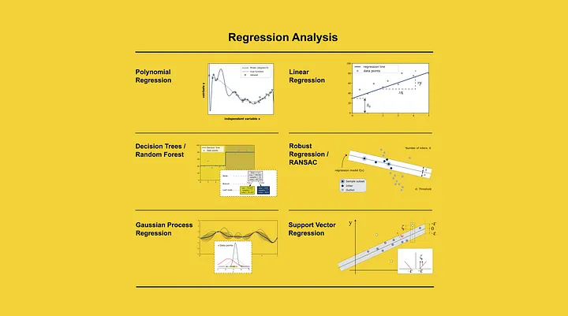

# sg-simple-image-processing
IMV's study group 

Pada modul ini kita akan belajar tentang pemrosesan gambar yang mudah dan simple.
Pemrosesan gambar yang paling mudah adalah menggunakan resource yang sudah tersedia yaitu open cv, numpy, dan juga pemanfaatan matplotlib.

## Transformasi warna lanjutan
Tabel berikut merupakan panduan sintaks transformasi warna menggunakan cv2 :
   
Contoh pengaplikasiannya ada di dalam file Image Processing.ipynb

## Morfologi

Morfologi digunakan untuk mengolah bentuk obyek dari citra biner untuk menghilangkan gangguan (noise) yang tidak termasuk bagian dari obyek. Operasi ini digunakan untuk memperjelas obyek dan menghilangkan celah-celah yang ada dilingkungannya.

Dalam cv2 ada 4 cara populer yaitu :
 
 - Erosi
    
    Konsepnya seperti erosi pada tanah. Batas batas pada objek di foreground akan tererosi. Sebisa mungkin buatlah si objek foreground ini berwarna putih.

    Cara kerjanya adalah kernel melintasi seluruh image (seperti konvolusi 2d). Pixel dari image asli akan dianggap 1 jika nilai pixels yang terbaca di bawah kernel bernilai 1. Jika tidak nilainya nanti akan di nol kan.

        import cv2 as cv
        import numpy as np
        img = cv.imread('j.png', cv.IMREAD_GRAYSCALE)
        assert img is not None, "file could not be read, check with os.path.exists()"
        kernel = np.ones((5,5),np.uint8)
        erosion = cv.erode(img,kernel,iterations = 1)
 - Dilasi
    
    Kebalikan dari erosi

        dilation = cv.dilate(img,kernel,iterations = 1)
 - Opening

    Erosi yang diikuti dilasi

        opening = cv.morphologyEx(img, cv.MORPH_OPEN, kernel)
 - Closing

    Dilasi yang diikuti erosi

        closing = cv.morphologyEx(img, cv.MORPH_CLOSE, kernel)

## Image Filtering

Mengaplikasikan filter pada sebuah citra. Filter sendiri dapat bervariasi tergantung keperluan. Disini akan dijelaskan 4 jenis filter saja, masih banyak contoh lainnya yang dapat dicari secara mandiri.

1. Averaging Filter
    
    Secara garis besar mencari rata-rata nilai dari pixels yang dilintasi kernel (konvolusi lagi) terus mengganti nilai tengah dengan hasil rata rata tsb. Hasilnya nanti image menjadi blur karena mengikuti rata-rata dari pixel sekitarnya

        import cv2 as cv
        import numpy as np
        from matplotlib import pyplot as plt
        img = cv.imread('nama image')
        assert img is not None, "file could not be read, check with os.path.exists()"
        blur = cv.blur(img,(5,5))
        plt.subplot(121),plt.imshow(img),plt.title('Original')
        plt.xticks([]), plt.yticks([])
        plt.subplot(122),plt.imshow(blur),plt.title('Blurred')
        plt.xticks([]), plt.yticks([])
        plt.show()

2. Gaussian Filter

    Bluring dengan distribusi rumus Gaussian. Gaussian sendiri berbeda dengan konvolusi biasa.

        blur = cv.GaussianBlur(img,(5,5),0)
3. Median Filtering

    Mengubah nilai median semua pixels dengan nilai median. Biasanya digunakan untuk mengurangi noise pada gambar yang gelap.

        median = cv.medianBlur(img,5)
4. Bilateral Filter

    Digunakan untuk menghilangkan noise dengan cara menghaluskan tekstur gambar.

        blur = cv.bilateralFilter(img,9,75,75)

## Edge Detection
Mengenali batas pada bentuk gambar

1. Robert

    Menggunakan cara mengukur gradien dari image sehingga lebih cepat dikomputasi.

        
        
        kernelx = np.array([[1, 0],[0, -1]])
        kernely = np.array([[0, 1], [-1, 0]])

        img_robertx = cv2.filter2D(gray, -1, kernelx)
        img_roberty= cv2.filter2D(gray, -1, kernely)
2. Prewitt

    Diciptakan oleh Judith M.S. Prewitt. Mampu mendeteksi 2 tipe edge yaitu:

    a. Horizontal edges or along the x-axis,

    b. Vertical Edges or along the y-axis.

        kernelx = np.array([[1, 0, -1], [1, 0, -1], [1, 0, -1]])
    kernely = np.array([[1, 1 , 1], [0, 0, 0], [-1, -1, -1]])

    img_prewittx = cv2.filter2D(gray, -1, kernelx)
    img_prewitty= cv2.filter2D(gray, -1, kernely)

3. Sobel

    Teknik sobel mendeteksi batas (edge) pada gambar jika menemukan perubahan drastis pada intensitas pixel.
    
    
        kernelx = np.array([[1, 0, -1], [2, 0, -2], [1, 0, -1]])
        kernely = np.array([[1, 2, 1], [0, 0, 0], [-1, -2, -1]])

        img_sobelx = cv2.filter2D(gray, -1, kernelx)
        img_sobely= cv2.filter2D(gray, -1, kernely)   
4. Canny

    Merupakan sintaks yang tersedia langsung dari open cv2.
    Secara teori melalui 4 tahap :

    1. Noise Reduction
    2. Mencari intensitas gradien
    3. Non-maximum Suppresion
    4. Hysteresis Thresholding

        edges = cv2.Canny(gray,100,200)

## Implementasi Haar Cascade
Semua yang telah dipelajari tadi dapat diimplementasikan pada penggunaan simple image processing.

Haar Cascade merupakan contoh simple dimana nantinya komputer dapat mengenali sebuah object dari pola yang ditangkapnya. Entah itu gabungan dari edge, warna, atau metode lainnya yang tidak akan dibahas karena terlalu matematis.

Kita dapat menggunakan Haar Cascde dengan mendownload terlebih dahulu file yang berisi "rumus" yang akan digunakan oleh komputer kita untuk mengenali suatu gambar.

Kali ini kita akan menggunakan frontal face detection.

Link download: https://github.com/opencv/opencv/tree/master/data/haarcascades

Cara meload

    face_classifier = cv2.CascadeClassifier(
    cv2.data.haarcascades + "haarcascade_frontalface_default.xml"
    )
    face = face_classifier.detectMultiScale(
    gray_image, scaleFactor=1.1, minNeighbors=5, minSize=(40, 40)
    )

Untuk menggambar bounding box dari deteksi

    for (x, y, w, h) in face:
    cv2.rectangle(img, (x, y), (x + w, y + h), (0, 255, 0), 4)

Tutorial akan dilanjutkan pada file simple_implementation.ipynb, berikut contoh image yang berhasil dideteksi:

### Referensi
https://docs.opencv.org/4.x/d9/d61/tutorial_py_morphological_ops.html
https://docs.opencv.org/4.x/d4/d13/tutorial_py_filtering.html
https://docs.opencv.org/4.x/da/d22/tutorial_py_canny.html